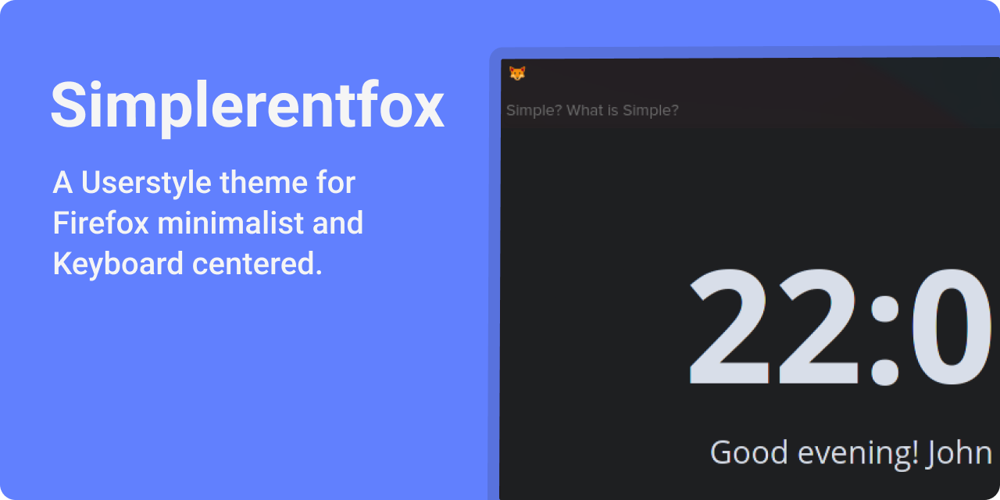
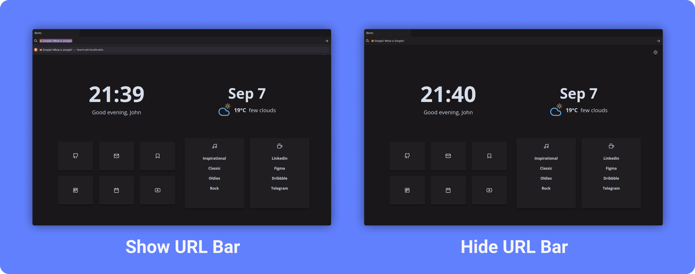
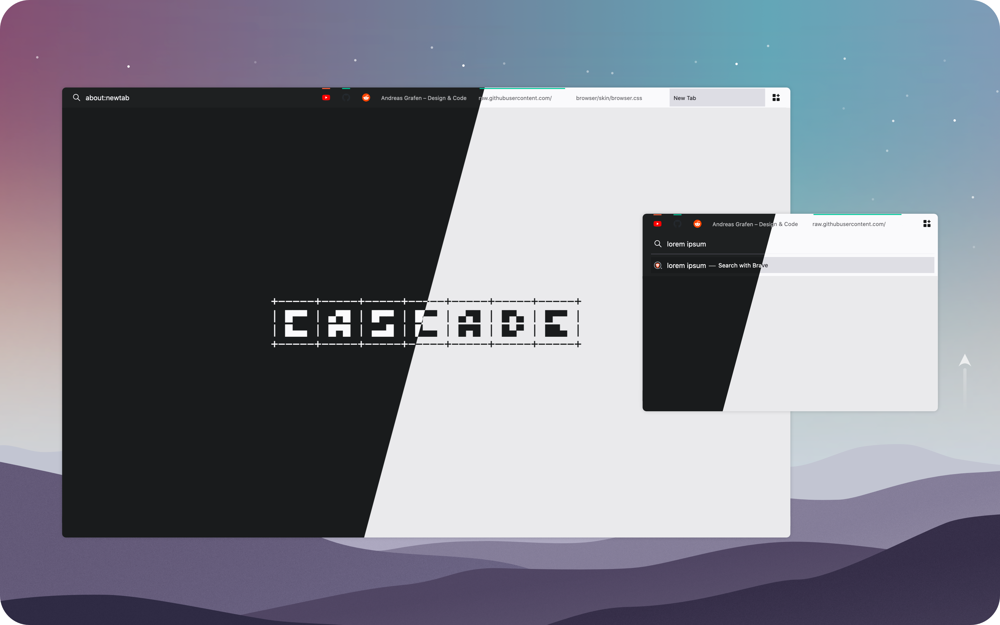

<p style="margin: -20px 0 30px">
  <a href="https://www.buymeacoffee.com/migueravila" target="_blank" style='margin-right:0px; margin-top:5px'>
    
  </a>
  <a href="https://raw.githubusercontent.com/migueravila/SimpleFox/master/assets/urlbar.png" target="_blank" style='margin-right:0px; margin-top:5px'>
    
  </a>
</p>

<br />

## 👇 Index

- [👇 Index](#-index)
- [💫 Features](#-features)
- [⚙️ Installation](#️-installation)
- [🚀 Usage](#-usage)
- [🎨 Customization](#-customization)
  - [💛 Colors](#-colors)
  - [🚧 URL Bar](#-url-bar)
  - [🔧 Recommended settings](#-recommended-settings)
  - [🍱 Startpage](#-startpage)
  - [⛲ One line version: Cascade](#-one-line-version-cascade)
- [⚠️ Notes](#️-notes)

## 💫 Features

-   Supports Firefox **Proton UI** 
-   **As simple as you want**: All code is commented!
-   **Variables** for custom colors: [Customization](#-customization)
-   **Keyboard** Centered Design! Here you can read about the shortcuts: [Usage](#-usage)

## ⚙️ Installation

1. In the searchbar type `about:config`. A dialog will be shown to you. Press the **I accept the risk** button.
2. Search for **`toolkit.legacyUserProfileCustomizations.stylesheets`**, **`layers.acceleration.force-enabled`**, **`gfx.webrender.all`**, and **`svg.context-properties.content.enabled`**. Change them to **True**
3. Go to your Firefox profile:
    - If you're on Linux: `$HOME/.mozilla/firefox/XXXXXXX.default-release/`
    - If you're on Windows: `C:\Users\<USERNAME>\AppData\Roaming\Mozilla\Firefox\Profiles\XXXXXXX.default-XXXXXX`
    - If you're on MacOS: `Users/<USERNAME>/Library/Application Support/Firefox/Profiles/XXXXXXX.default-XXXXXXX` 
4. Move the `chrome` folder into the directory.
5. Make all the customizations you want [here](#-customization).
6. Enjoy!

## 🚀 Usage

This userstyle was made for a keyboard centered usage, like Tilling Window Manager users or just cool people that loves them! Use the following for a better experience:

-   `Alt` You can access to the global menu for an extended options you need
-   `Alt + Left Arrow` You can go Back
-   `Alt + Right Arrow` You can go Forward
-   `Ctrl + L` focuses the Navbar
-   `Ctrl + B` shows you the Bookmarks 
-   `Ctrl + H` shows you the History Bar
-   `Ctrl + T` Opens a new Tab
-   `Ctrl + W` Closes a Tab
-   `Ctrl + Shift + T` Re-opens a tab that you just closed
-   `Ctrl + R` Refresh the page you're on
-   `Ctrl + Shift + A` Quick open for Add-Ons

## 🎨 Customization

All the configuration will be managed in the `userChrome.css` file. And also all the code is commented so you can easily change values and colors as you like.

### 💛 Colors

In this section of the code you can change the colors, there's a window color and a tabs / urlbar color. 

```css

:root {
  --sfwindow: #19171a;
  --sfsecondary: #201e21;
}


```

### 🚧 URL Bar



You can show and hide the URL Bar (See the difference above) by commenting / uncomment the following section of code:

```css
/*─────────────────────────────*/
/* Comment this section if you */
/* want to show the URL Bar    */
/*─────────────────────────────*/

.urlbarView {
  display: none !important;
}

/*─────────────────────────────*/

```

### 🔧 Recommended settings

- Right click on toolbar -> Customize.
  - Remove (as you want) all the removable elements including extensions, drag space and buttons.
- Install the [SimpleFox](https://addons.mozilla.org/en-US/firefox/addon/simplerentfox/) add on theme.


### 🍱 Startpage

If anyone has the doubt, in almost all of the screenshots you can see a Startpage made for it. It's called [Bento 🍱](https://github.com/MiguelRAvila/Bento) and It's another project I made. It fits with the Firefox theme because It's done with the same principles: Minimalist, Simple and Elegant.


###  ⛲ One line version: Cascade

[Andreas Grafen](https://github.com/andreasgrafen/) has made an awesome work making a One Line theme inspired by SimpleFox. As it's work is awesome and allows you customization I can totally recomend it. Here you can find his repo: [Link](https://github.com/andreasgrafen/cascade)


## ⚠️ Notes

- As Firefox changed at version 88 introducing the Proton UI, all the old files and configurations moved to [oldFirefox](https://github.com/migueravila/SimpleFox/tree/oldFirefox) branch.
- Windows and MacOS are currently tested but may not be in the future.
- Some custom themes (And GTK themes in Linux) may break context menus.