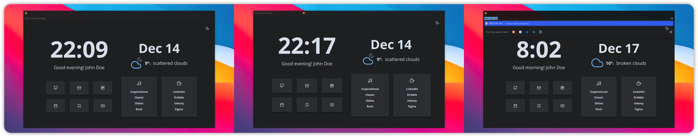

<div align="center">
<h1>SimplerentFox</h1>
<b>🦊 Minimalist, Simple and Keyboard Centered</b>
</div>


## Index

-   [SimplerentFox](#)
    -   [Features](#features)
    -   [Installation](#installation)
    -   [Customization](#customization)
         - [All Versions](#three-versions)
         - [Own Colors and Opacity](#your-own-colors-and-opacity)
         - [Show buttons](#an-element-you-need-doesnt-show-you-can-easily-add-them-again)
    -   [Usage](#usage)
    -   [Startpage](#startpage)
    -   [Ports](#ports)

## Features

-   **As simple as you want**: All code is commented!
-   **Variables** for custom opacity and colors: [Customization](#customization)
-   Tab bar, URLBar and Sidebar **transparent**!
-   **Keyboard** Centered Design! Here you can read about the shortcuts: [Usage](#usage)

## Installation

1. In the searchbar type `about:config`. A dialog will be shown to you. Press the **I accept the risk** button.
2. Search for **`toolkit.legacyUserProfileCustomizations.stylesheets`**, **`layers.acceleration.force-enabled`**, **`gfx.webrender.all`**, and **`svg.context-properties.content.enabled`**. Change them to **True**
3. Go to your Firefox profile:
    - If you're on Linux: `$HOME/.mozilla/firefox/XXXXXXX.default-release/`
    - If you're on Windows: `C:\Users\<USERNAME>\AppData\Roaming\Mozilla\Firefox\Profiles\XXXXXXX.default-XXXXXX`
    - If you're on MacOS: `Users/<USERNAME>/Library/Application Support/Firefox/Profiles/XXXXXXX.default-XXXXXXX` 
4. Create a folder and name it **`chrome`** (with lowercase).
5. You can choose between the three versions: **HideURLBar**, **WithURLBar** and **OneLine** (You can see them here: [Versions](#three-versions)). Once you choose your version  and rename the file you choose into `userChrome.css`.
6. Then paste the `userChrome.css` and the `userContent.css` files into the folder.
7. (Optional) If you don't know if use a theme or not, you can use the Add-on theme I made for a better experience: [Add-on Theme](https://addons.mozilla.org/en-US/firefox/addon/simplerentfox)
8. Enjoy!

## Customization

-   You can choose between three files `userChrome__HideURLBar`, `userChrome__WithURLBar` and `userChrome__OneLine` . Don't forget to delete the rest of the text in the file name and just have `userChrome`!
-   You can check the sections (all of them are commented) and make the changes you want!
-   You can use the variables at the beggining of the file to change the colors!

### Three Versions

SimplerentFox has three central versions:



<div align="center">
<h5>Hide URL Bar | One Line | With URL Bar</h5>
</div>

### Your own colors and opacity:

In this section of the code you can change the colors, it's in RGBA so you can easily change the opacity and accent color, by default it's `#186efd60`

```css

:root {
    --srf-color-primary: rgba(20, 20, 20, 0.6);
    --srf-color-selection: #66a6d9;
}

```

### An element you need doesn't show? You can easily add them again

In this section you can comment adding `/* */` around the button you want to show.

```css

/* This one is the forward button  */
#forward-button {
    display: none !important;
}

/* This one is the back button  */
#back-button {
    display: none !important;
}

/* And many more... */

```

## Usage

> This userstyle was made for a keyboard centered usage, like Tilling Window Manager users or just cool people that loves them! 🤖
> In this section I show you some cool shortcuts you can use with this theme for a better experience

-   `Alt` You can access to the global menu for an extended options you need
-   `Alt + Left Arrow` You can go Back
-   `Alt + Right Arrow` You can go Forward
-   `Ctrl + L` focuses the URLBar, which is very useful for quick searches and bookmarks usage
-   `Ctrl + B` shows you the Bookmarks 
-   `Ctrl + H` shows you the History Bar
-   `Ctrl + T` Opens a new Tab
-   `Ctrl + W` Closes a Tab
-   `Ctrl + Shift + T` Re-opens a tab that you just closed
-   `Ctrl + R` Refresh the page you're on
-   `Ctrl + Shift + A` Quick open for Add-Ons

## Startpage

If anyone has the doubt, in almost all of the screenshots you can see a Startpage made for it. It's called [Bento 🍱](https://github.com/MiguelRAvila/Bento) and It's another project I made. It fits with the Firefox theme because It's done with the same principles: Minimalist, Simple and Elegant.

<p align="center">
  
</p>

In the repo I have all the steps for you to use it!

## Ports

> This userstyle was made in Linux and looking for a simple and clean look for the Firefox Web browser and ports to other OS are on mind.

### Windows port

A Simple and Keyboard Centered userstyle for Windows!


In addition to the `userChrome.css` and `userContent.css` files you'll also need the `dark_additional_windows.css`, `dark_checkboxes_and_radios.css` and `dark_context_menus.css` files in your **chrome** directory

> ### Transparency Note
>
> Transparency in Windows breakes the window behavior. You can change the colors in the variable section of the code and still add transparency, but the window manager will have some bugs with maximized firefox.
